# 个性化学习计划管理系统 - UML图

本文档包含系统的用例图、时序图、架构图、数据流图的PlantUML代码。

---

## 一、用例图 (Use Case Diagram)

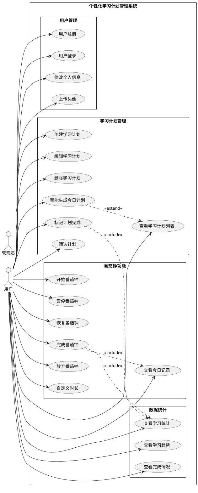

---

## 二、时序图 (Sequence Diagram)

### 2.1 用户登录时序图

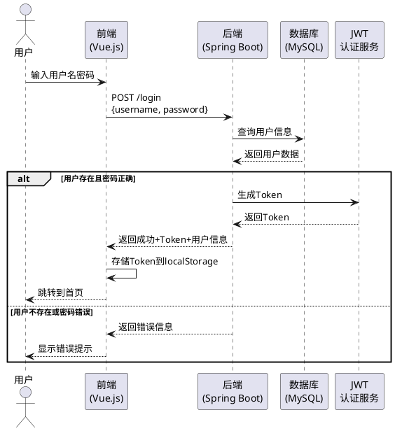

### 2.2 智能生成今日计划时序图

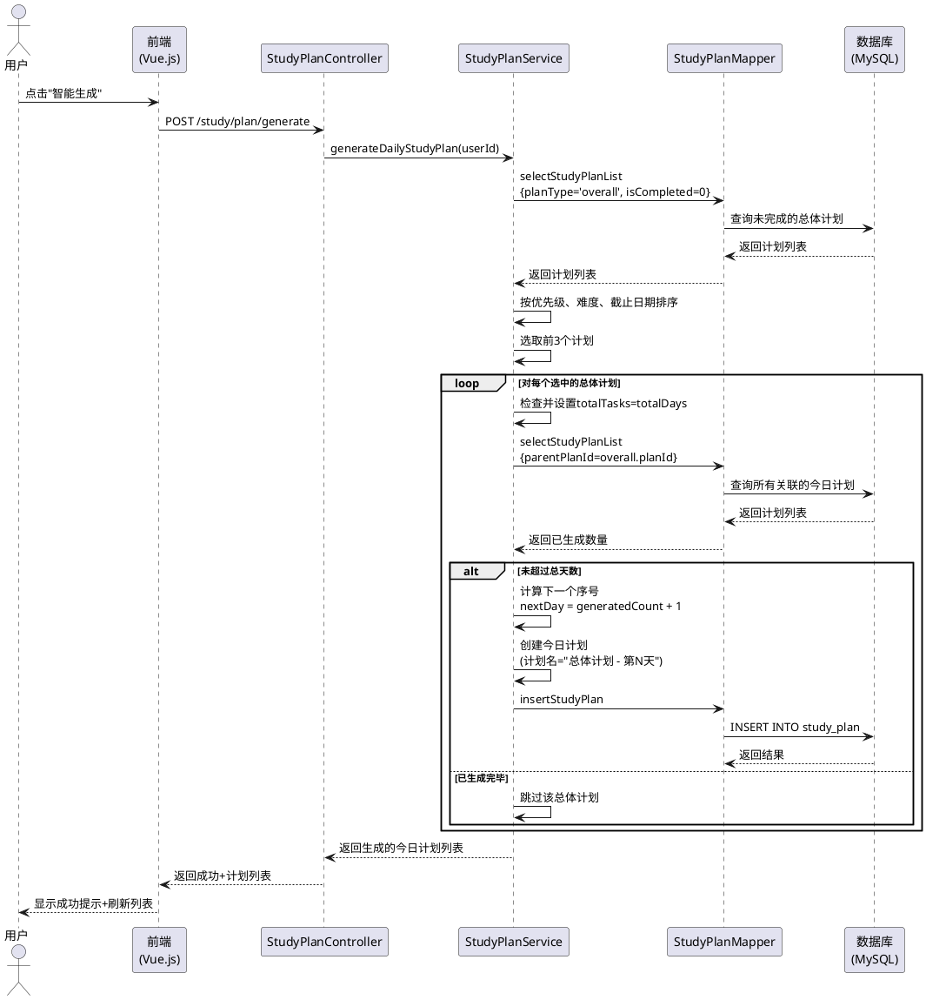

### 2.3 番茄钟完成时序图

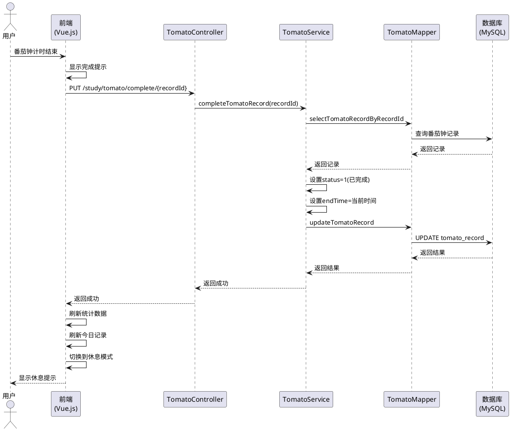

### 2.4 学习统计数据加载时序图

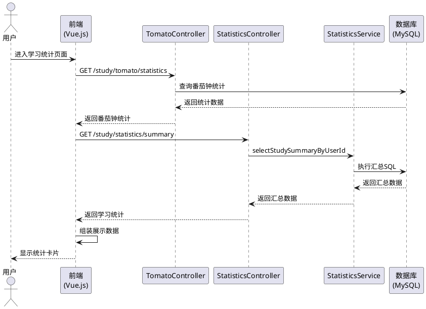

---

## 三、架构图 (Architecture Diagram)

### 3.1 系统整体架构图

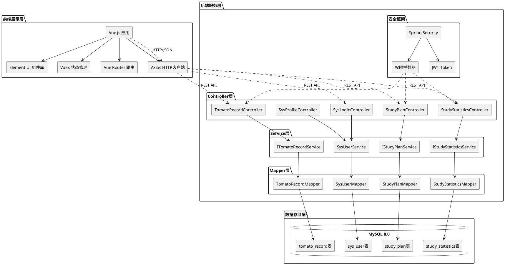

### 3.2 前端模块架构图

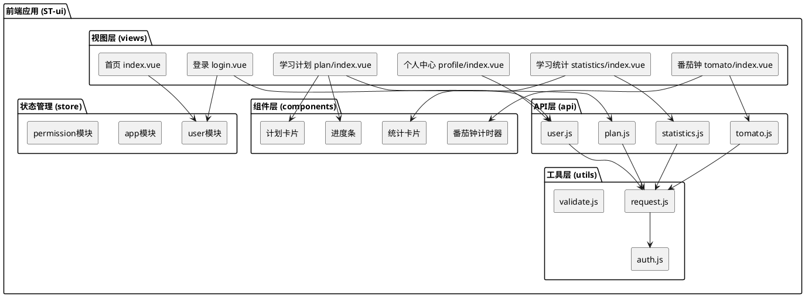

### 3.3 后端分层架构图

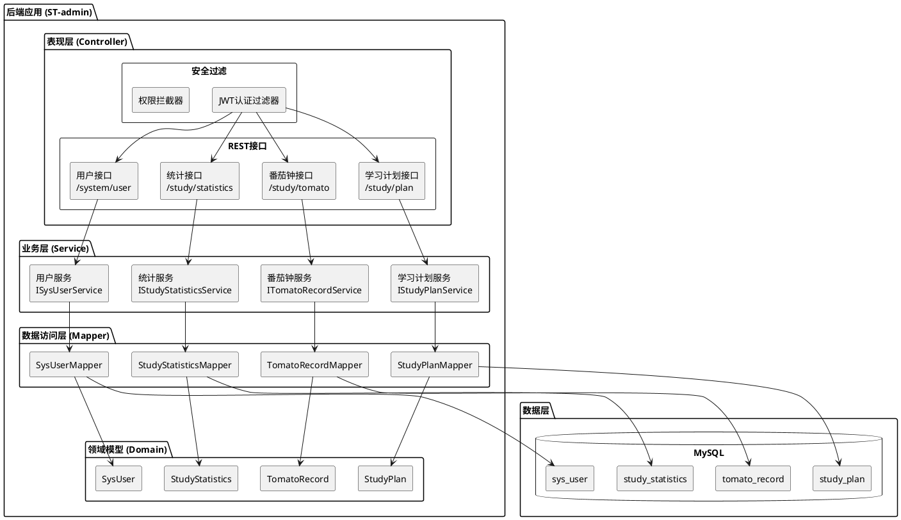

---

## 四、数据流图 (Data Flow Diagram)

### 4.1 顶层数据流图 (Level 0 DFD)

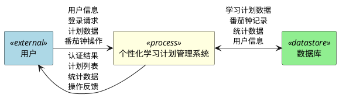

### 4.2 一层数据流图 (Level 1 DFD)

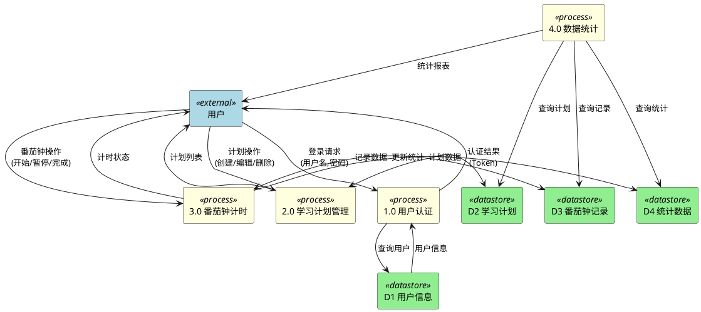

### 4.3 二层数据流图 - 学习计划管理 (Level 2 DFD - Plan Management)

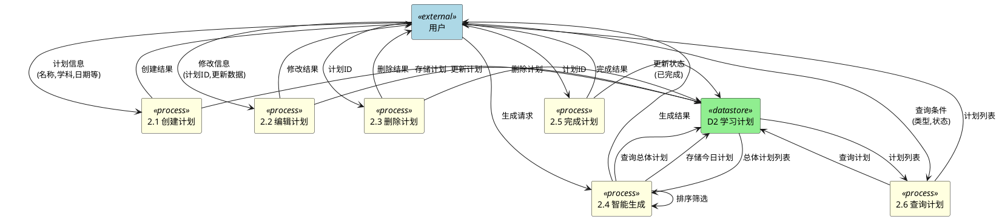

### 4.4 二层数据流图 - 番茄钟计时 (Level 2 DFD - Tomato Timer)

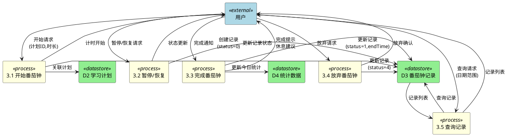

---

## 五、类图 (Class Diagram)

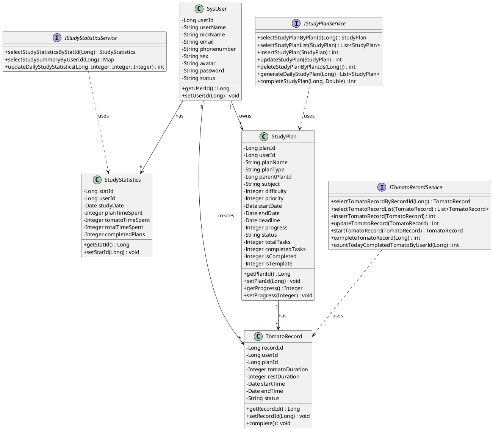

---

## 六、ER图 (Entity-Relationship Diagram)

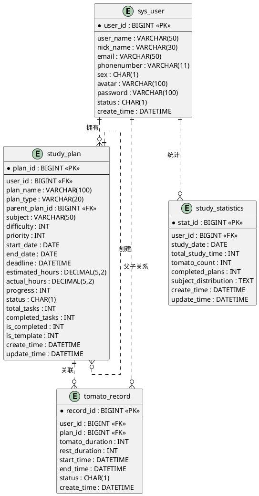

---

## 使用说明

### 在线渲染工具

1. **PlantUML官方服务器**: https://www.plantuml.com/plantuml/uml/
2. **VS Code插件**: 安装 "PlantUML" 插件，可直接预览
3. **IDEA插件**: 安装 "PlantUML Integration" 插件

### 本地渲染方法

1. 安装Java运行环境
2. 安装Graphviz（绘图工具）
3. 下载PlantUML jar包
4. 运行命令：
```bash
java -jar plantuml.jar diagrams.puml
```

---

<p align="center">
  © 2026 个性化学习计划管理系统 - UML设计文档
</p>
